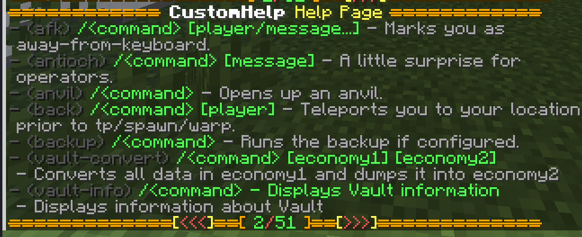

# CustomHelp
CustomHelp is a simple plugin that intercepts every command executed on the server (by the players) and prevents it from executing if certain conditions are met.
This way it is possible to display custom "command not found" or "not enough permissions" messages in chat that many command do not support.

| Table of Contents               |
|---------------------------------|
| [Commands](#Commands)           |
| [Configuration](#Configuration) |
| [Messages](#Messages)           |

## Commands
The plugin only supports one command: ```/help```. 
This command displays all the possible commands that can be executed by the user with their respective description, usage, permission and aliases (check [Configuration](#Configuration) for more).
It supports multi-paging meaning that there could be more pages to show every possibility.
Also, if the user specifies a command (for example ```/help help```), the plugin will show more info about that command.

## Configuration
The plugin config.yml is where you can control the plugin behaviour.
Here's an example:
```yaml
# The following are settings of the /help command.
command-settings:
  # By changing the name, the command will not be /help but /<new-name>
  name: "help"
  # The aliases of the help command.
  aliases: ["?"]
  # The description shown when executing /help help
  description: "&eShows a help page with every command you can execute."

# If a player execute a command that is available on the server, 
# but she/he does not have permission to execute it, 
# they will receive a "Command not found" message instead of a "Permission not found".
hide-commands: true

commands:
  # The name of the plugin (CaSe SeNsItIvE).
  message:
    # Many commands do not have a default description.
    # By setting this value here, you will overwrite the
    # default one.
    description: "&4This is the message command. #FF00AAThis plugin supports HEX colors!"
    # Just like description but for command usage.
    usage: "/message <player> <message>"
    # When a player executes /message [args], the command will
    # be replaced with /msg [args]
    replacement: "msg"
    # If blacklist is set to true, the command will NOT be
    # available to any player, even if they have permission
    # to execute it. The only exception is for players
    # that have permission "customhelp.bypass" or
    # "customhelp.bypass.<command-name>".
    blacklist: false
    # If whitelist is set to true, the command will be
    # available to every player, meaning that every check
    # determining if a user can execute it or not are
    # delegated to the command itself (basically
    # disabling intercepting for this command).
    whitelist: false
```

## Messages
The messages.yml file contains all the plugin messaging strings.
It's important to note two categories:

### Command Format
```yaml
general:
  # The format shown when executing /help <command-name>
  command-format: "&eHelp for &6%command%:\n&eDescription: &6%description%\n&ePermission: &6%permission%\n&eUsage: &6%usage%\n&eAliases: &6[%aliases%]\n"
```

### Help Format
```yaml
help:
  # The format shown for every command entry when executing /help <page>
  format: "&8- &8(%command%) &a%usage% &7- %description%"
  # By changing below values you will change how the plugin displays
  # every help page. See the picture below to understand how it
  # will be displayed by default.
  page: "&f&l %plugin-name% &eHelp Page "
  page-format: "&6[ &a%page%&c/&a%max-page% &6]"
  page-separator: "&6&l&m="
  page-previous: "&e[&c<<<&e]%page-separator%%page-separator%"
  page-next: "%page-separator%%page-separator%&e[&c>>>&e]"
```

